## Where I'm at

- I'm feeling pretty damn tired today. I think I'm coming down with something so I'm just going to take it pretty easy today. I think I'll brush up on some learning for today since I can do that in a pretty relaxed way.

  I think going over Svelte 5's Runes again in more detail would be good. [I'm going to watch this series.](https://youtu.be/-SM77ksjpJI?si=PLduBTKmJWBrNxT6)

- The internet keeps cutting in and out, and it's utterly infuriating trying to watch the video above.

## What I learnt

### Svelte 5 Runes

- Svelte 5 Runes are more or less analogous to Javascript Signals
- **Stores vs Signals**
  - **Stores**
    - Created at build / compile time, as all connections are created at one time.
    - Think that the compiler ships a spiderweb of all connections.
    - Only has shallow reactivity, as you have to wire up all types of effects ahead of time.
  - **Signals**
    - Svelte 5 retains a compiler, but it creates something that's more readable. It's not a spiderweb.
    - When a value is accessed, a relationship is also created. This also means it has nested (or really just deep) reactivity built-in, instead of needing to be wired up manually.
- Reactivity more or less means figuring out what code is dependant on (e.g. "When do I change?" or "When do I make this API call?" or "When do I change color?").
  - Stores depends on concretely defined relationships
  - Signals depends on behaviours
- **House Build Analogy**
  - Really this all comes down to the difference between trying to create a house (the application) overselves, versus creating a robot worker that creates the house for us.
  - Building the house ourselves, can only be built once at compile time. These are stores. This means we will have to anticipate a lot of scenarios ahead of time to ensure we get everything right.
  - Building a robot worker to build the house during runtime, means we can remove that complexity by giving it sensors (signals) and decision-making abilities (runes). That way the robot can react based on it's environment, rather than sticking to a rigid plan.

As explained below:


### A Runes Heuristic: SOLID Creation Checklist

When creating a Rune, ask yourself:

- S - **Sources**: What are all the source values this Rune depends on?
- O - **Operations**: What operations are performed on these sources?
- L - **Logic**: Are there any conditional logic or branching that affects the result?
- I - **Indirect Dependencies**: Are there any derived values this Rune uses?
- D - **Dynamic Dependencies**: Could the dependencies change based on conditions?

Remember: If it's read, it's a dependency!

In more detail:

Let's break down this SOLID heuristic:

1. Sources: Identify all the primary data sources ($state variables) that your Rune uses. This is your starting point.
2. Operations: Consider all the operations performed on these sources. Each operation might introduce a dependency.
3. Logic: If your Rune includes conditional logic, ensure all branches are accounted for in your dependencies.
4. Indirect Dependencies: If your Rune uses other derived values, remember that it indirectly depends on their dependencies too.
5. Dynamic Dependencies: In some cases, the dependencies themselves might change based on conditions. Be aware of these scenarios.

The key principle to remember is: "If it's read, it's a dependency!" This means any value that your Rune reads or uses in any way should be considered a dependency.

Here's an example of applying this heuristic:

```
const price = $state(10);
const quantity = $state(2);
const discountRate = $state(0.1);
const isVIP = $state(false);

const totalCost = $derived(() => {
  // S: price, quantity, discountRate, isVIP
  // O: multiplication, conditional subtraction
  // L: condition for VIP discount
  // I: none in this case
  // D: discount application depends on isVIP

  const basePrice = price * quantity;
  if (isVIP) {
    return basePrice - (basePrice * discountRate);
  }
  return basePrice;
});
```

In this example, by going through our SOLID checklist, we ensure that `totalCost` correctly depends on all relevant values: `price`, `quantity`, `discountRate`, and `isVIP`.

### In general

- Watching just that little bit more of videos explaining the overall logic to a langauge, framework, etc will help tenfold down the line. 

  The point being is, by giving that extra bit of effort, you save yourself hundredfold more effort down the line.

## What I did

- Revisited all of last week's study journal entries, and the important parts to me were:
  - Keeping a flexible development strategy is key to making sure you avoid as many pitfalls as possible from over-engineering to under preparing.
  - Documenting how things are done, including your reasoning on decisions is a critical skill in engineering, especially software engineering. **NB:** This would also mean understanding _why_ certain technology was created to overcome certain issues and to use that to our advantage.
  - Being able to show someone you are competent is so much more powerful than just saying it.

- Went through Svelte 5 Runes again, because I'm feeling dead tired.