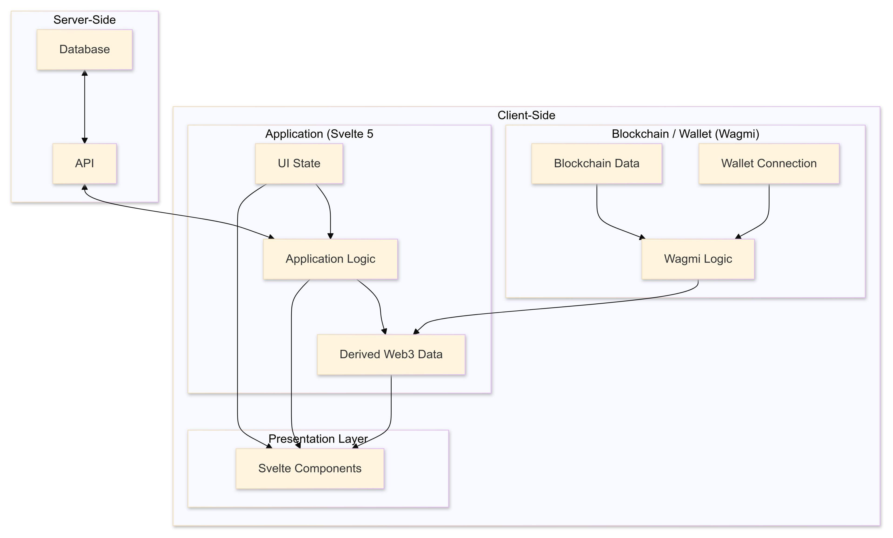

# Where I'm at

- Still continuing on with my personal crypto project, trying to work through the functionality needed, without double handling of the work.
  - e.g. Wagmi already has in-built state management, while I'd like to be able to use Runes to handle reactivity, there's not much point redoing the whole thing just to use Runes for the sake of using them.
- Gotta fix the dark mode of the subscribe mail card!

# What I learnt

- I finally figured out what the personal crypto project's architecture is. Using the `data / logic / presentation` paradigm I came up with the following diagram:



- I'll explain as follows:

  Wagmi Core already has in-built state management of the blockchain / wallet data and logic. It already knows how to capture and then return that data, and keep it in sync with the actual wallet / blockchain.

- Basically everything else, requires our own state management as needed. This means:
  - Storing non-blockchain / server-side data
  - Writing main application logic
  - Storing derived Web3 data
  - Mutating the UI State / Svelte Components

## A pratical example

Let's consider a simple wallet connection button. I won't go into the code here, but we'll see it on a high level.

The wallet button does these things:

- The wallet initially has no connection
- If the wallet is not connected, then display the message "No wallet connected"
- If the button is pressed, then it attempts to connect to the client wallet
- If the wallet is connected, then display the truncated wallet address (e.g. "0x ... 8as4") as the message with "Connected to: `truncatedWallet`
- If the button is pressed, then prompt the user "Do you want to disconnect?" with simple Yes / No options.
- If Yes, then disconnect the wallet, and return to the not connected state, which then displays the "No wallet connected" message.
- If No, then simply exit the prompt.

Let's just rule out what we WON'T be using:

- Blockchain Data -- we're not interacting with the blockchain
- Database / API calls -- there's no conceivable need to retrieve anything from the database, except for maybe some fancy cached logs or transaction history or something, but not for now.

Using the chart, we'd then have to configure the following:

- UI State
- Application Logic
- Derived Web3 Data
- Svelte Components

We'd also have to configure this, but not as much as the others (which are basically from scratch):

- Wallet Connection
- Wagmi Logic

This is going to take a while, but it's important to run through in detail so we get a clear understanding, or we re-evaluate our architecture model.

### UI State

If you refer back to the outline of the simple wallet connect button, we can see that we'll have to define the message that we want to display:

- `Message` state which is `$derived` from the connection status, and address of the account connected.
  - **Connection Status:** we can return either a string from `account.status`, or a boolean value from `account.is[status]`
    - `'connecting'` = `message: "Wallet is attempting to connect ..."`
    - `'reconnecting'` = `message: "Wallet is attempting to reconnect ..."`
    - `'connected'` = `message: "Connected to: [truncatedWallet]."`
    - `'disconnected'` = `message: "No wallet is connected."`
  - **Address:** this is a string, or `undefined` if not connected.
    - If the wallet is connected, then the returned address should be truncated to the standard truncation: "0x ... XXXX", which is then used by the `Message`.
    - Cannot do anything if `undefined`

If we wanted say a traffic light indicator (e.g. green light for connected) for those connection statuses -- then we'd have to create another `$derived` value, using the connection status value.

Also, we'd create a simple boolean state for `isOpen` to confirm if the dialog is open when the user clicked the button, and the connection status is connected.

So then the code looks like this:

```
const account = getAccount(config)

// Derived values
$derived message = (() => {
  switch (account.status) {
    case 'connecting':
      return "Wallet is attempting to connect ..."
    case 'reconnecting':
      return "Wallet is attempting to reconnect ..."
    case 'connected':
      return `Connected to: ${truncateAddress(account.address)}`
    case 'disconnected':
    default:
      return "No wallet is connected."
  }
})()

$derived indicator = (() => {
  switch (account.status) {
    case 'connected':
      return 'green'
    case 'connecting':
    case 'reconnecting':
      return 'yellow'
    case 'disconnected':
    default:
      return 'red'
  }
})()

// Simple state
let isOpen = $state(false)

// Helper function
function truncateAddress(address: string | undefined): string {
  if (!address) return ''
  return `${address.slice(0, 6)}...${address.slice(-4)}`
}
```

So now we have values that reacts to a change in Wagmi values, and returns a simple string message, gives us a traffic light indicator string, can tell if the confirmation dialog is open or not, and has a helper function to truncate the address string.

### Application Logic

This is where we really start to get into the guts of the component itself. If you remember back to the wallet description it goes like this:

- If not connected, then display the appropriate message, and on click attempt to connect to the wallet allowed in the Config.
- If connect, do the same except on click show a disconnect dialog, where we give the user a binary choice of "Yes" or "No" to disconnect.
- If the choice is "Yes" then disconnect the wallet, if the choice is "No" then simply close the dialog.

But let's stay on track with our diagram. The application logic either affects the presentation layer of the Svelte Component, or it affects the Derived Web3 Data:

- Well we have no data that we're pulling in, so we're unlikely to touch the Derived Web3 Data part. If we were doing something really fancy then this would be where we'd be mixing in data from the database for instance.
- So it largely leaves the logic of how the Presentation Layer itself is changed, and thankfully for us this really comes down to the `isOpen` value, and it'd be triggered on click from the Svelte Component, when the connection status is `'connected'`.

The code would then be looking like this:

```
async function handlePress() {
  switch (account.status) {
    case 'connecting':
    case 'reconnecting':
      return null;
    case 'connected':
      isOpen = true;
      break;
    case 'disconnected':
    default:
      await connect(config, { connector: injected() });
  }
}
```

- Or alternatively we could use a simple boolean value for `account.isConnected`, if true, then on click it opens the disconnection confirmation dialog. If false, then it tries to connect to the client.

### Derived Web3 Data

Here is where we start to think of what data are flowing in from the Wallet Connection, this has more or less already been covered in the UI State, so we'll just go over what's relevant.

With this wallet button, there's no need for blockchain data, so it's exclusively what the Wallet Connection is feeding us.

What is derived from this is the `Message` and the `Indicator`, otherwise we don't have any other data that we need to worry about.

### Svelte Components

So we're now into really defining what exactly the button needs to look like, which isn't really the point of this exercise. It's to show the decisions as we move slowly throughout the architecture so we don't get lost.

But clearly in a real project, you'd then be creating the actual interface, including how it looks after the change has occurred. This case it'd be defining:

- The button, and
- The confirmation dialog

```
<button
  class="button"
  onclick={handlePress}
  >
  {message}
</button>

<dialog
  class="dialog"
  >
    <button
      class="dialog-yes"
      onclick={disconnect}
      >
      Yes
    </button>

    <button
      class="dialog-no"
      onclick={dismiss}
      >
      No
    </button>
</dialog>
```

### Wallet Connection & Wagmi Logic

As you can see, the reason why we don't really bother with going over this in much detail is because it's already covered in the UI State / Derived Web3 data portions.

For this reason, we can see why we would not really need to bother with creating another system on top of this, as it's already working into our application.

# What I did

- Applying the Moduo method, I revisited the functionality required for the low-level Web3 interactions, using Wagmi this includes:

  - **Config:** This is the starting point. It creates an instance of Config which powers all of the components used.
  - **Account:** When the instance of the Config is returned, then you can access values of the currently connected account.
