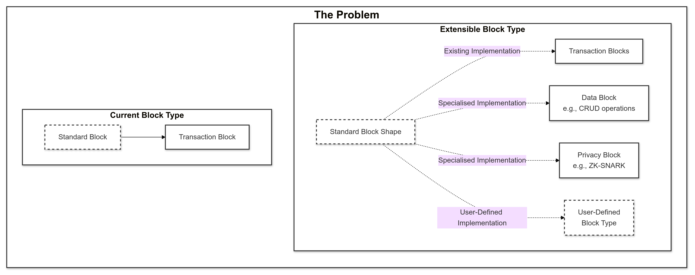

# Where I'm at

- Still working through my Javascript study
- Considering creating a technical case study for defining the shape of a standard block
- Creating the documentation for my business

# What I learnt

- Sounds obvious but _generally_ speaking nodes in a blockchain store the entirety of the blockchain on their own hardware as a file.
  - Each block is a file, and the Ethereum blockchain is currently 1141.64 GB (not including historical blocks?).
  - There's optimisations with this such as pruning, sharding, etc

# What I did

- Created a diagram to help me understand the problem of block types, and where we need to move towards:

- Basically where to go from here is creating a technical case study, and if the research supports it, then trying to create a standard, of which probably creating a superset of Solidity would be the best approach for adoption.
- Well good thing I had a scope around, because that's basically what Substrate and Polkadot are trying to accomplish. They beat me to it before I even knew what I was trying to accomplish.

# What I reviewed

The content that I reviewed today was: [Study Journal entry for 31-07-2024](./sj-20240731.md)

- At the time I was working through my own crypto project, (which is still in the works) but was heavily concerned about avoiding the pitfalls of under-planning and over-planning.
  - In the meantime I have heard about **test driven development** which is an interesting approach that I haven't looked at, but it sounds like what I did a lot when I was creating my mobile app. Create, test, create, test, etc.
  - Context switching is terrible when it comes to software design because it destroys your mental "model" that spent time building. It becomes more apparent when you consider that even non-technical people can build abstract / logical models fairly well.
  - Avoiding context switching in software development is the opposite of diminishing returns, it has **appreciating returns** with more time to focus and build mental models.
- A really interesting point about understanding the "shape" of people's understanding:
  - Intrinsic characteristics (e.g. interests, goals, motivations, etc) create the "shape".
  - Someone who can see this "shape" becomes that person's ultimate tutor.
- A good point to reiterate that code will never be perfect, so just forget even being able to attain that.
  - The maniacal focus on efficiency, might be a bygone relic of mainframes. Now we have ample memory, storage, processing power, etc.
  - It's good to write efficient code because it shows the ability to improve code but a lot of the time the optimisations are imperceptible.
  - Blockchain development still requires this focus however.
